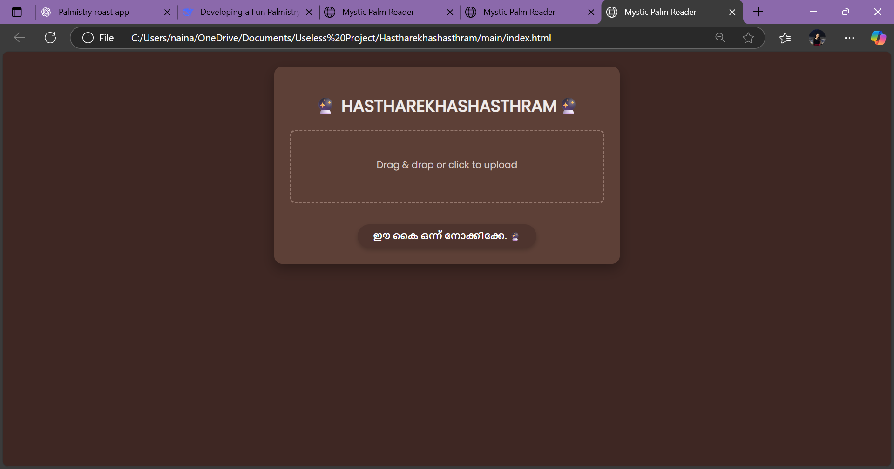
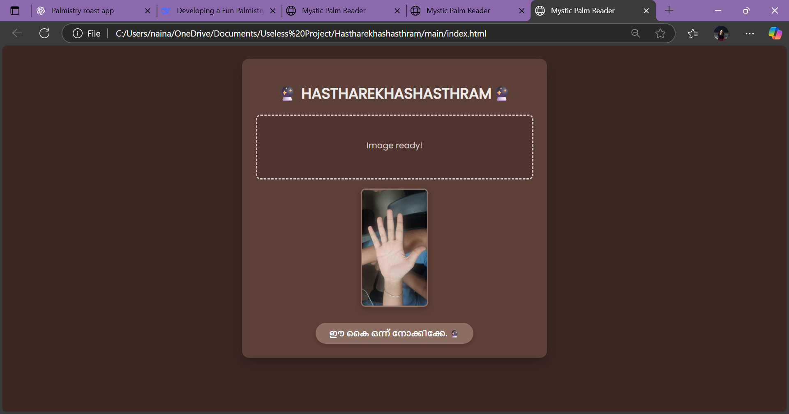
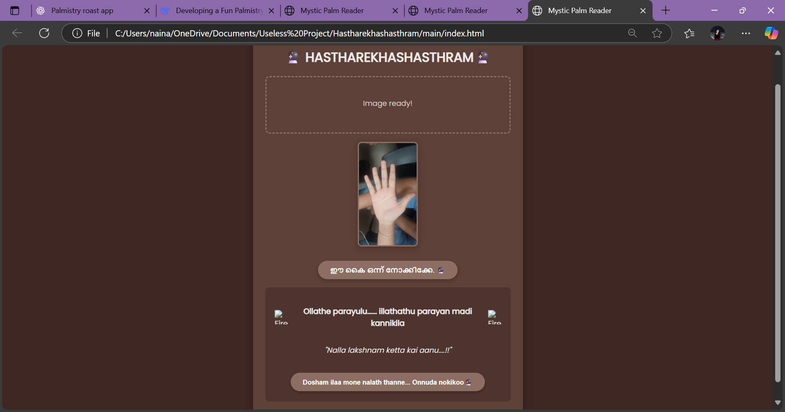

# [HASTHAREKHASHASTHRAM] 🎯

## Basic Details
### Team Name: [TAKA]

### Team Members
- Team Lead: [NANDANA S NAIR] - [LBSITW]
- Member 2: [NAINA MARIAM PRAJEESH] - [LBSITW]

### Project Description
[IT IS USELESS PROJECT WHERE THE WEBSITE DOES FAKE PALMISTRY,WHERE SOMEONE COULD UPLOAD THEIR PALM IMAGE AND THE WEBSITE WILL ROAST THEM.]

### The Problem (that doesn't exist)
[WE ARE REALLY CURIOUS ABOUT OUR TOMORROWS AND WE NEVER MOVES ON FROM OUR PAST]

### The Solution (that nobody asked for)
[DON'T WORRY,TAKE IT EASY.]

## Technical Details
### Technologies/Components Used
For Software:
- [HTML,JAVASCRIPT,CSS]
- [No frameworks – Pure vanilla JS for speed & simplicity]
- [NO libraries]
- [Tools used
Development Tools

VS Code (or any code editor)

Browser Dev Tools (Chrome/Firefox for debugging)

Core Technologies

HTML5 (for app structure)

CSS3 (animations, styling)

Vanilla JavaScript (no frameworks)

Key Browser APIs

Drag-and-Drop API (for image uploads)

FileReader API (to preview images)

Web Audio API (for sound effects)

Assets

Google Fonts (Poppins font)

Custom Icons (e.g., fire.png, mystic-eye.png)

Sound Effects (MP3 files for interactions)

Design

CSS Animations (@keyframes for spinners/transitions)

Flexbox/Grid (layout)]

For Hardware:
- [List main components]
- [List specifications]
- [List tools required]

### Implementation
For Software:
# Installation
[commands]

# Run
[commands]

### Project Documentation
For Software:

# Screenshots (Add at least 3)

*Add caption explaining what this shows*

*Add caption explaining what this shows*

*Add caption explaining what this shows*

# Diagrams

*Add caption explaining your workflow*

For Hardware:

# Schematic & Circuit

*Add caption explaining connections*

*Add caption explaining the schematic*

# Build Photos

*List out all components shown*

*Explain the build steps*

*Explain the final build*

### Project Demo
# Video
[WhatsApp Video 2025-08-02 at 05.09.00_74489787.mp4]
*Explain what the video demonstrates*

# Additional Demos
[Add any extra demo materials/links]

## Team Contributions
- [Nandana S Nair]: [Project idea and coding]
- [Naina Mariam Prajeesh]: [Coding and debugging]
- 

---
Made with ❤️ at TinkerHub Useless Projects 

